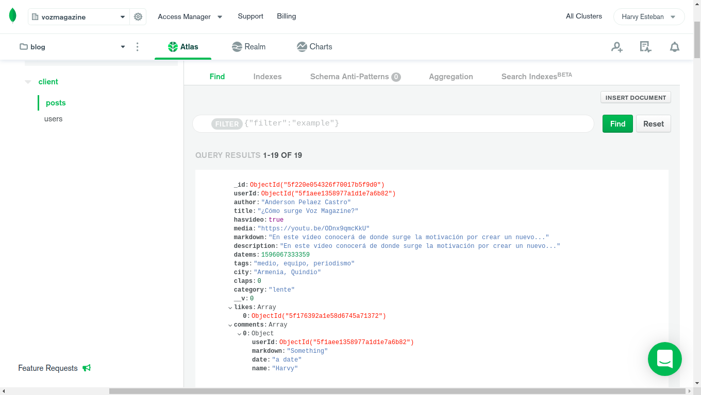
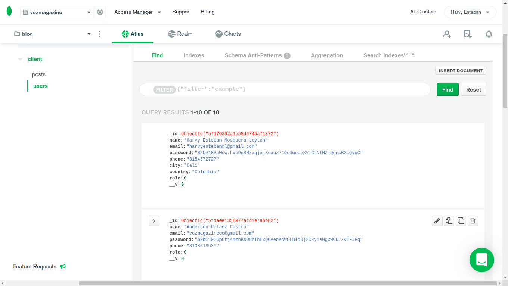

# vozmagazine
This is the vozmagazine.com public repository, an app for honest and independent journalism.


in order to run this project in your machine you should do this first.

#### add a .env file with the following

~~~
MONGO=mongodb+srv://<mongodbuser>:<mongodbpassword>@cluster0.fgn02.mongodb.net/client?retryWrites=true&w=majority
PWD=<mongodbpassword>
SESSION_SECRET=secretStringFOREncryption
SENDGRID_API_KEY=YOURSECRETSENGRIDAPIKEY
~~~

#### install npm dependencies

Just run ```npm install``` 

#### start the server

Run ```npm start``` this will start a development server on localhost:3000

#### now you should structure your mongodb database this way

##### Posts db structure


##### Users db structure


You're ready to go!